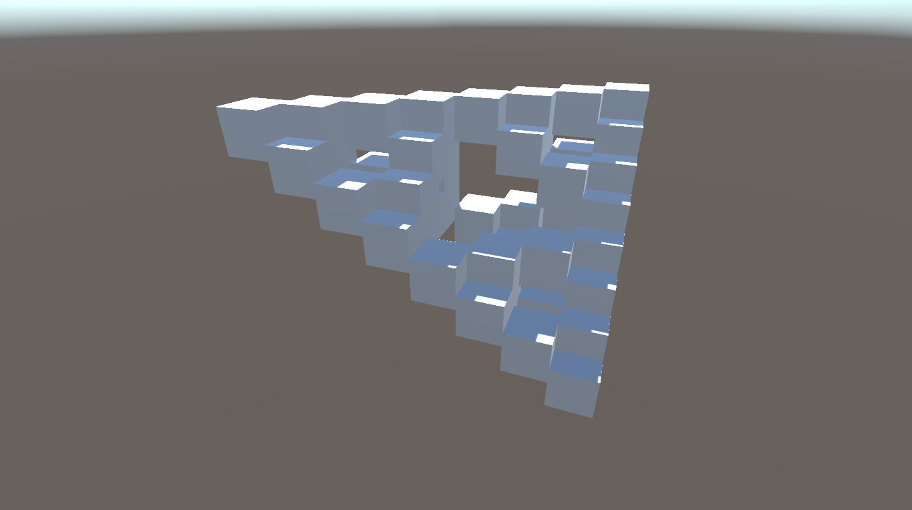
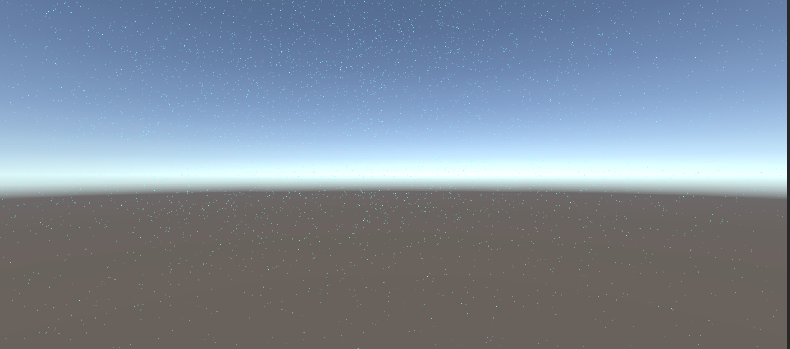

# コンピュートシェーダ
描画以外のGPUの使い方です。

## 結果画像

## 自分なりにかっこいいシーン

# 自分なりに変更した点
-円状から直線状に変更させ出現させた
-色を統一し雨を表現
-落下を遅く

# 進め方

- 本リポジトリをフォークしてください
- フォークしたリポジトリをcloneします
- Unityのプロジェクトを更新して実装してください。
  - 結果画像1（一番上の画像）と同じシーンを「1_SampleScene」に実現してください
  - 結果画像2（二番目の画像）と同じようなシーンを「2_ParticleScene」に実現してください
  - 自分なりにかっこいいシーンを「My Best Scene」に作成してください
- 「My Best Scene」の結果をUnity Recorder等で保存し、result.pngという名前にして本ディレクトリの物と差し替えてください（動画の方が好ましいです）
- このテキストファイルに変更点を記載してください
- プルリクエストを出して提出してください
